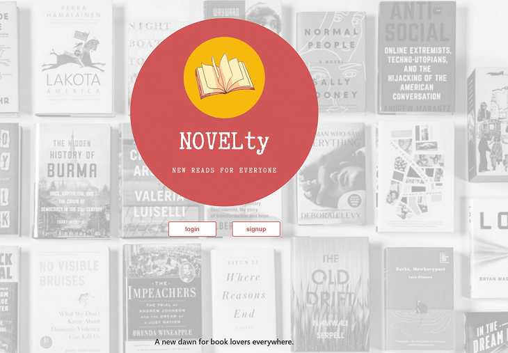
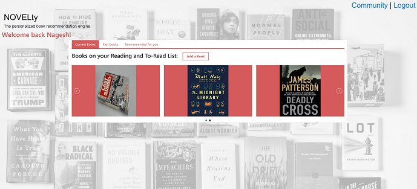

# NOVELty (Project #2)
Have you ever read a book and thought to yourself: “I need to share this book with someone?”. 
<br><br>
YOU HAVE COME TO THE RIGHT PLACE!!.
<br><br>
NOVELty is one-stop shop for keeping track of all the books you are reading/read, get personalized book recommendations and participate in your book reading community by sharing the book that you like and partcipate in book reviews. 

## Description
NOVELty is a full-stack application devloped using Node, Express, JavaScript, MySQL, Sequelize, Handlebars, Bootstrap, HTML, CSS, Passport, ORM and several APIs.

- The application allows a user to sign up with their email address 
- Once signed in, users can keep track of books they are reading/read, get personalized recommendations, and save the desired books to their reading list.
- User also has the option to join a vibrant book community and take part in book review process.
- User's book ratings and reviews are viewable by their peers.

## Link to functional application deployed on Heroku:
https://novelty.herokuapp.com/

## Table of Contents

- [Team Members](#team-members)
- [Description](#description)
- [User Story](#user-story)
- [Installation](#installation)
- [Usage](#usage)
- [Credits](#credits)
- [License](#license)
- [Contributing](#contributing)
- [Feedback](#feedback)

## Team Members
* [Annie Kwan](https://github.com/akwanmtl)
* [Héctor García Millares](https://github.com/hector-gm)
* [Ivan Đuranić](https://github.com/ivanduranic)
* [Nagesh Kalegowda](https://github.com/nagck)
* [Natasha Fray](https://github.com/Tasha876)

## User Story
- As someone always looking to recommend new books based on my preferences.<br>
I want to be able to have the app track whether I finish reading it or not<br>
So that I can have books recommended to me based on similar interests and the ratings given by the API.

- As a user of the app,<br> 
I want a clean dashboard interface to easily view and update my preferences, books and recommendations.<br>
So that I can easily use and navigate the app and spend more time reading.

- As a fan of books,<br> 
I want to be able to share my literary preferences, list of books read, and books I’m reading.<br>
So that I can receive recommendations from other users with similar tastes.

- As a user of the app,<br> 
I want to be able to share personal ratings of books to others.<br>
So that others can find out whether or not users with similar book preferences recommend them or not.<br>

## Installation

1. To install this code, download the zip file and extract the files to a designated directory on your node.js server without changing the directory/folder structure, or use GitHub's guidelines to clone the repository. 
2. Once the code is extracted, navigate to the project directory and execute 'npm install' command to install node.js and related dependencies.
3. Create an empty database schema in MySQL database. Note: In case you do not have a running MySQL database, you can download and install the same from [MySQL Community Server](https://dev.mysql.com/downloads/mysql).
4. Update MySQL connection information in config.json file with correct MySQL database/port/user/password details.

Also, the application is currently hosted on Heroku and you can access it at https://novelty.herokuapp.com.

## Usage
The application can be invoked by using the following command and follow the instructions after that:

```bash
node server.js
```
Point your browser to http://localhost:8080/ to start using the application.  

## Screenshot of the application:




## Technologies Used: 
* Node.js, Express, Passport
* JavaScript, CSS, HTML
* npm
* MySQL database
* ORM
* Handlebars
* JQuery lightSlider
* APIs:
    - [TasteDive](https://tastedive.com/read/api)
    - [Google Books](https://developers.google.com/books/docs/overview)
    - [OpenLibrary](https://openlibrary.org/developers/api)
    - [The New York Times Books API](https://developer.nytimes.com/docs/books-product/1/overview)

## Credits
- The application has been developed using JavaScript, Node.js, Express, npm, MySQL, ORM, Handlebars and APIs. 
- Sincere thanks to our course instructors Ed (Edward Apostol), Anas (Anas Qazi) and Herman (German Arcila) for teaching and helping us in acquring HTML/CSS/JavaScript/Node.js/MySQL skills. 

- AND, OF COURSE SINCERE THANKS TO ALL OUR PROJECT MEMBERS.

- Here are some websites that we referred to develop the application:
    * https://www.npmjs.com/
    * https://www.npmjs.com/package/express
    * https://www.w3schools.com/nodejs/
    * https://dev.mysql.com/
    * https://handlebarsjs.com/
    * http://sachinchoolur.github.io/lightslider/
    * https://developer.mozilla.org/en-US/docs/Web/JavaScript
    * https://www.w3schools.com/js/default.asp
    * https://sqlbolt.com/
    * https://www.postman.com/
    * https://www.npmjs.com/package/node-fetch
    * https://www.npmjs.com/package/passport
    * https://www.npmjs.com/package/request* 
    * https://medium.com/@dtkatz/3-ways-to-fix-the-cors-error-and-how-access-control-allow-origin-works-d97d55946d9


## License
Licensed under the [MIT](https://choosealicense.com/licenses/mit/) license.<br>
<br />

## Contributing

Pull requests are welcome. For any changes, please open an issue first to discuss what you would like to change.

## Feedback
Feedback is always appreciated. If you are interested in fixing any issues and contributing directly to the code base, please provide at:
- GutHub Pull Requests: [https://github.com/nagck/novelty/pulls](https://github.com/nagck/novelty/pulls)
